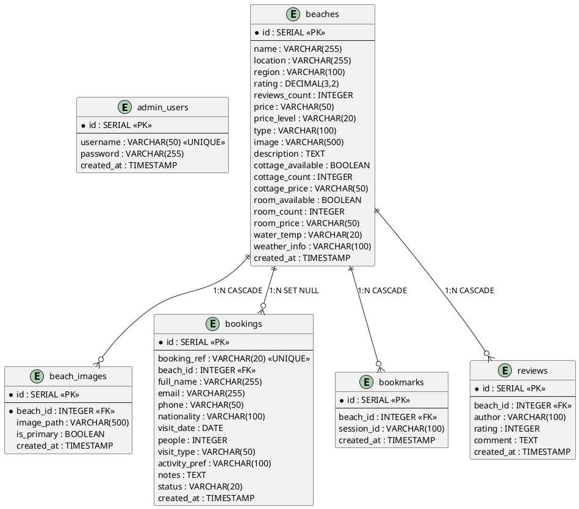
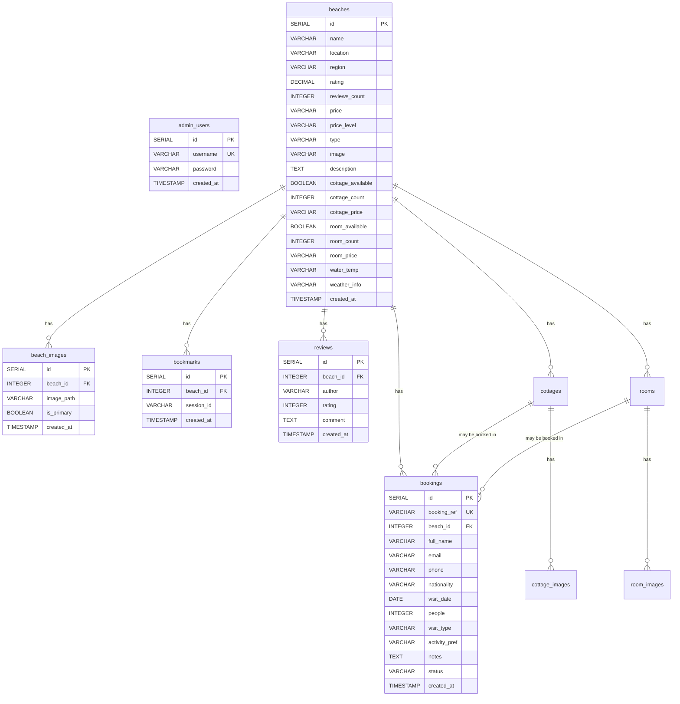

# AllenShores PH - Database Schema Documentation

> Complete database schema for the AllenShores PH Beach Comparison System.
> Use this document to create an ERD (Entity-Relationship Diagram).

---

## Database: PostgreSQL (Supabase)

### Tables Overview

| # | Table | Description | Records (seed) |
|---|-------|-------------|----------------|
| 1 | `admin_users` | Admin accounts who manage the system | 2 |
| 2 | `beaches` | Beach listings with full details | 3 |
| 3 | `beach_images` | Multiple images per beach | 1 |
| 4 | `bookings` | Customer booking reservations | 2 |
| 5 | `bookmarks` | User bookmarked beaches (by session) | 1 |
| 6 | `reviews` | User-submitted beach reviews | 1 |

---

## Table: `admin_users`

Stores administrator accounts who can log in to the admin dashboard.

| Column | Type | Constraints | Default | Description |
|--------|------|-------------|---------|-------------|
| `id` | SERIAL | PRIMARY KEY | auto-increment | Unique admin ID |
| `username` | VARCHAR(50) | UNIQUE, NOT NULL | — | Login username |
| `password` | VARCHAR(255) | NOT NULL | — | Bcrypt-hashed password |
| `created_at` | TIMESTAMP | NOT NULL | CURRENT_TIMESTAMP | Account creation date |

### Seed Data

| id | username | password (bcrypt hash) | created_at |
|----|----------|------------------------|------------|
| 1 | admin | $2a$10$66bGFm2r8ieTG5vcvPUq7OU/LEs3OWIKszEJwYSzYao9YLdWTjK4e | 2026-09-02 15:47:36 |
| 2 | van | $2a$10$HYOA02ttav//0uiLfOsZlOlaOidcpOt5VRHvs6QOOZMZXTqq0C702 | 2026-09-02 16:21:34 |

> Default login: `admin` / `admin123`

---

## Table: `beaches`

Stores all beach listings with full details including availability, pricing, and weather.

| Column | Type | Constraints | Default | Description |
|--------|------|-------------|---------|-------------|
| `id` | SERIAL | PRIMARY KEY | auto-increment | Unique beach ID |
| `name` | VARCHAR(255) | NOT NULL | — | Beach name |
| `location` | VARCHAR(255) | — | NULL | Specific location (barangay) |
| `region` | VARCHAR(100) | — | 'Allen' | Region/municipality |
| `rating` | DECIMAL(3,2) | — | 0.00 | Average rating (auto-calculated from reviews) |
| `reviews_count` | INTEGER | — | 0 | Number of reviews (auto-calculated) |
| `price` | VARCHAR(50) | — | '0' | Entrance fee (stored as string for flexibility) |
| `price_level` | VARCHAR(20) | CHECK IN ('Budget','Moderate','Premium') | 'Budget' | Price category |
| `type` | VARCHAR(100) | — | 'Beach' | Beach type (Beach, Resort, Cove, White Sand, etc.) |
| `image` | VARCHAR(500) | — | NULL | Primary image URL (Cloudinary or local path) |
| `description` | TEXT | — | NULL | Full beach description |
| `cottage_available` | BOOLEAN | — | FALSE | Whether cottages are available |
| `cottage_count` | INTEGER | — | 0 | Number of cottages |
| `cottage_price` | VARCHAR(50) | — | '0' | Cottage rental price |
| `room_available` | BOOLEAN | — | FALSE | Whether rooms are available |
| `room_count` | INTEGER | — | 0 | Number of rooms |
| `room_price` | VARCHAR(50) | — | '0' | Room rental price |
| `water_temp` | VARCHAR(20) | — | NULL | Water temperature (e.g. "28°C") |
| `weather_info` | VARCHAR(100) | — | NULL | Current weather conditions |
| `created_at` | TIMESTAMP | NOT NULL | CURRENT_TIMESTAMP | Listing creation date |

### Seed Data

| id | name | location | region | rating | reviews_count | price | price_level | type | image | description |
|----|------|----------|--------|--------|---------------|-------|-------------|------|-------|-------------|
| 2 | Sunrise Beach Resort | Brgy. Sabang, Allen | Allen | 4.50 | 18 | 200 | Moderate | Resort | /uploads/beaches/beach_1788410013333_713.jpg | Perfect spot for watching the sunrise with resort amenities. |
| 7 | Caba Villa Diaz Beach | Brgy. Caba, Allen | Allen | 4.80 | 25 | 150 | Budget | White Sand | NULL | A beautiful white sand beach with crystal clear waters. |
| 9 | Paradise Cove | Brgy. Jubasan, Allen | Allen | 5.00 | 1 | 100 | Budget | Cove | NULL | A hidden cove with calm waters, perfect for swimming. |

---

## Table: `beach_images`

Stores multiple images for each beach (one-to-many relationship with `beaches`).

| Column | Type | Constraints | Default | Description |
|--------|------|-------------|---------|-------------|
| `id` | SERIAL | PRIMARY KEY | auto-increment | Unique image ID |
| `beach_id` | INTEGER | NOT NULL, FOREIGN KEY → `beaches(id)` ON DELETE CASCADE | — | Reference to beach |
| `image_path` | VARCHAR(500) | NOT NULL | — | Image URL (Cloudinary or local path) |
| `is_primary` | BOOLEAN | — | FALSE | Whether this is the primary/hero image |
| `created_at` | TIMESTAMP | NOT NULL | CURRENT_TIMESTAMP | Image upload date |

### Indexes

| Index Name | Column |
|------------|--------|
| `idx_beach_images_beach_id` | `beach_id` |

### Seed Data

| id | beach_id | image_path | is_primary | created_at |
|----|----------|------------|------------|------------|
| 1 | 2 | /uploads/beaches/beach_1788410013333_713.jpg | TRUE | 2026-09-03 04:33:33 |

---

## Table: `bookings`

Stores customer booking reservations for beaches.

| Column | Type | Constraints | Default | Description |
|--------|------|-------------|---------|-------------|
| `id` | SERIAL | PRIMARY KEY | auto-increment | Unique booking ID |
| `booking_ref` | VARCHAR(20) | UNIQUE, NOT NULL | — | Booking reference code (e.g. BK-XXXXXXXX) |
| `beach_id` | INTEGER | FOREIGN KEY → `beaches(id)` ON DELETE SET NULL | — | Reference to beach |
| `full_name` | VARCHAR(255) | NOT NULL | — | Customer full name |
| `email` | VARCHAR(255) | NOT NULL | — | Customer email |
| `phone` | VARCHAR(50) | — | NULL | Customer phone number |
| `nationality` | VARCHAR(100) | — | NULL | Customer nationality |
| `visit_date` | DATE | NOT NULL | — | Planned visit date |
| `people` | INTEGER | — | 1 | Number of guests |
| `visit_type` | VARCHAR(50) | — | 'day_trip' | Type of visit (day_trip, overnight) |
| `activity_pref` | VARCHAR(100) | — | NULL | Preferred activity |
| `notes` | TEXT | — | NULL | Additional notes |
| `status` | VARCHAR(20) | CHECK IN ('pending','confirmed','cancelled') | 'pending' | Booking status |
| `created_at` | TIMESTAMP | NOT NULL | CURRENT_TIMESTAMP | Booking creation date |

### Indexes

| Index Name | Column |
|------------|--------|
| `idx_bookings_beach_id` | `beach_id` |

### Seed Data

| id | booking_ref | beach_id | full_name | email | phone | nationality | visit_date | people | visit_type | activity_pref | notes | status | created_at |
|----|-------------|----------|-----------|-------|-------|-------------|------------|--------|------------|---------------|-------|--------|------------|
| 1 | BK-9YC2I7HN | 9 | Arnulfo Joshua Lim | jovanramones00@gmail.com | 09925989543 | Filipino | 2026-09-04 | 5 | overnight | swimming | na | confirmed | 2026-09-03 05:18:00 |
| 2 | BK-0D85SRC7 | 9 | Arnulfo Joshua Lim | jovanramones00@gmail.com | 09925989543 | Filipino | 2026-09-04 | 1 | overnight | relaxation | test | confirmed | 2026-09-03 05:50:44 |

---

## Table: `bookmarks`

Stores user-bookmarked beaches, identified by browser session ID (no login required).

| Column | Type | Constraints | Default | Description |
|--------|------|-------------|---------|-------------|
| `id` | SERIAL | PRIMARY KEY | auto-increment | Unique bookmark ID |
| `beach_id` | INTEGER | FOREIGN KEY → `beaches(id)` ON DELETE CASCADE | — | Reference to beach |
| `session_id` | VARCHAR(100) | NOT NULL | — | Browser session identifier |
| `created_at` | TIMESTAMP | NOT NULL | CURRENT_TIMESTAMP | Bookmark creation date |

### Constraints

| Constraint | Columns | Type |
|------------|---------|------|
| `unique_bookmark` | `beach_id`, `session_id` | UNIQUE (prevents duplicate bookmarks) |

### Seed Data

| id | beach_id | session_id | created_at |
|----|----------|------------|------------|
| 2 | 2 | sess_1788364341098_3fhxek1dd | 2026-09-02 16:21:08 |

---

## Table: `reviews`

Stores user-submitted reviews and ratings for beaches.

| Column | Type | Constraints | Default | Description |
|--------|------|-------------|---------|-------------|
| `id` | SERIAL | PRIMARY KEY | auto-increment | Unique review ID |
| `beach_id` | INTEGER | FOREIGN KEY → `beaches(id)` ON DELETE CASCADE | — | Reference to beach |
| `author` | VARCHAR(100) | NOT NULL | — | Reviewer name |
| `rating` | INTEGER | NOT NULL | — | Rating from 1 to 5 |
| `comment` | TEXT | — | NULL | Review comment text |
| `created_at` | TIMESTAMP | NOT NULL | CURRENT_TIMESTAMP | Review submission date |

### Indexes

| Index Name | Column |
|------------|--------|
| `idx_reviews_beach_id` | `beach_id` |

### Seed Data

| id | beach_id | author | rating | comment | created_at |
|----|----------|--------|--------|---------|------------|
| 4 | 9 | test | 5 | test | 2026-09-03 05:04:45 |

---

## Entity Relationships (ERD)

### Relationship Summary

```
┌──────────────┐
│  admin_users  │  (standalone - no relationships)
└──────────────┘

┌──────────────┐       ┌──────────────┐
│    beaches    │◄──────│ beach_images  │
│              │  1:N  │              │
│              │       └──────────────┘
│              │
│              │       ┌──────────────┐
│              │◄──────│   bookings    │
│              │  1:N  │              │
│              │       └──────────────┘
│              │
│              │       ┌──────────────┐
│              │◄──────│  bookmarks    │
│              │  1:N  │              │
│              │       └──────────────┘
│              │
│              │       ┌──────────────┐
│              │◄──────│   reviews     │
│              │  1:N  │              │
└──────────────┘       └──────────────┘
```

### Detailed Relationships

| Parent Table | Child Table | Type | Foreign Key | On Delete |
|--------------|-------------|------|-------------|-----------|
| `beaches` | `beach_images` | 1 : N | `beach_images.beach_id` → `beaches.id` | CASCADE |
| `beaches` | `bookings` | 1 : N | `bookings.beach_id` → `beaches.id` | SET NULL |
| `beaches` | `bookmarks` | 1 : N | `bookmarks.beach_id` → `beaches.id` | CASCADE |
| `beaches` | `reviews` | 1 : N | `reviews.beach_id` → `beaches.id` | CASCADE |

### Relationship Descriptions

1. **beaches → beach_images (1:N)**
   - One beach can have multiple images.
   - If a beach is deleted, all its images are automatically deleted (CASCADE).
   - One image per beach can be marked as `is_primary = TRUE`.

2. **beaches → bookings (1:N)**
   - One beach can have multiple bookings.
   - If a beach is deleted, bookings keep their record but `beach_id` becomes NULL (SET NULL).
   - This preserves booking history even if the beach is removed.

3. **beaches → bookmarks (1:N)**
   - One beach can be bookmarked by multiple user sessions.
   - If a beach is deleted, all bookmarks for it are removed (CASCADE).
   - Unique constraint prevents the same session from bookmarking the same beach twice.

4. **beaches → reviews (1:N)**
   - One beach can have multiple reviews.
   - If a beach is deleted, all its reviews are removed (CASCADE).
   - When a review is created/deleted, the beach's `rating` and `reviews_count` are automatically recalculated.

---

## All Constraints Summary

### Primary Keys

| Table | Column |
|-------|--------|
| `admin_users` | `id` |
| `beaches` | `id` |
| `beach_images` | `id` |
| `bookings` | `id` |
| `bookmarks` | `id` |
| `reviews` | `id` |

### Unique Constraints

| Table | Column(s) | Constraint Name |
|-------|-----------|-----------------|
| `admin_users` | `username` | (inline) |
| `bookings` | `booking_ref` | (inline) |
| `bookmarks` | `beach_id`, `session_id` | `unique_bookmark` |

### Check Constraints

| Table | Column | Check |
|-------|--------|-------|
| `beaches` | `price_level` | IN ('Budget', 'Moderate', 'Premium') |
| `bookings` | `status` | IN ('pending', 'confirmed', 'cancelled') |

### Foreign Keys

| Child Table | Column | Parent Table | Parent Column | On Delete |
|-------------|--------|--------------|---------------|-----------|
| `beach_images` | `beach_id` | `beaches` | `id` | CASCADE |
| `bookings` | `beach_id` | `beaches` | `id` | SET NULL |
| `bookmarks` | `beach_id` | `beaches` | `id` | CASCADE |
| `reviews` | `beach_id` | `beaches` | `id` | CASCADE |

---

## All Indexes Summary

| Index Name | Table | Column(s) | Purpose |
|------------|-------|-----------|---------|
| (PK) `admin_users_pkey` | `admin_users` | `id` | Primary key |
| (PK) `beaches_pkey` | `beaches` | `id` | Primary key |
| (PK) `beach_images_pkey` | `beach_images` | `id` | Primary key |
| (PK) `bookings_pkey` | `bookings` | `id` | Primary key |
| (PK) `bookmarks_pkey` | `bookmarks` | `id` | Primary key |
| (PK) `reviews_pkey` | `reviews` | `id` | Primary key |
| `idx_beach_images_beach_id` | `beach_images` | `beach_id` | FK lookup performance |
| `idx_bookings_beach_id` | `bookings` | `beach_id` | FK lookup performance |
| `idx_reviews_beach_id` | `reviews` | `beach_id` | FK lookup performance |

---

## Business Rules

1. **Admin Authentication**
   - Admins log in with username + password (bcrypt-hashed).
   - JWT token issued on login, valid for 24 hours.
   - Cannot delete the last remaining admin account.

2. **Beach Ratings**
   - `rating` and `reviews_count` in `beaches` are auto-calculated.
   - When a review is created: `rating = AVG(rating)`, `reviews_count = COUNT(*)`.
   - When a review is deleted: same recalculation, `rating` defaults to 0 if no reviews left.

3. **Beach Images**
   - Each beach can have unlimited images (max 10 per upload).
   - Only one image can be `is_primary = TRUE` at a time.
   - Primary image URL is also stored in `beaches.image` for quick access.
   - Images are hosted on Cloudinary (or local filesystem in dev).

4. **Bookings**
   - Booking reference is auto-generated: `BK-` + 8 random alphanumeric chars.
   - Status flow: `pending` → `confirmed` or `cancelled`.
   - Email notifications sent on status change to confirmed/cancelled.

5. **Bookmarks**
   - No login required - uses browser session ID.
   - One bookmark per beach per session (unique constraint).
   - Toggle behavior: click to add, click again to remove.

6. **Reviews**
   - No login required - anyone can submit a review.
   - Rating must be 1-5.
   - Author name is required.

---

## Full SQL Schema (Copy-Paste Ready)

```sql
-- =============================================
-- AllenShores PH - PostgreSQL Schema
-- =============================================

W

---

## ERD Diagram (PlantUML Format)

Copy-paste this into [PlantUML](https://plantuml.com/ie-diagram) or any ERD tool:



---

## ERD Diagram (Mermaid Format)

Copy-paste this into [Mermaid Live Editor](https://mermaid.live):



---

## Cottages & Rooms (Added 2026-09-12)

Run `server/schema-properties.sql` in the Supabase SQL Editor to add these tables.

### Table: `cottages`
Individual cottage listings per beach (managed by Super Admin & Owners).

| Column | Type | Constraints | Default | Description |
|--------|------|-------------|---------|-------------|
| `id` | SERIAL | PRIMARY KEY | auto | Unique cottage ID |
| `beach_id` | INTEGER | FK → beaches(id) CASCADE | — | Owning beach |
| `name` | VARCHAR(255) | NOT NULL | — | Cottage name |
| `description` | TEXT | — | — | Description |
| `price` | VARCHAR(50) | — | '0' | Price per unit |
| `capacity` | INTEGER | — | 2 | Pax capacity |
| `quantity` | INTEGER | — | 1 | Units available |
| `is_available` | BOOLEAN | — | TRUE | Visible to users |
| `created_at` | TIMESTAMP | — | now() | Creation time |

### Table: `cottage_images`
| Column | Type | Constraints | Default |
|--------|------|-------------|---------|
| `id` | SERIAL | PRIMARY KEY | auto |
| `cottage_id` | INTEGER | FK → cottages(id) CASCADE | — |
| `image_path` | VARCHAR(500) | NOT NULL | — |
| `is_primary` | BOOLEAN | — | FALSE |
| `created_at` | TIMESTAMP | — | now() |

### Table: `rooms`
Same structure as `cottages` but for room listings (`beach_id` FK → beaches).

### Table: `room_images`
Same structure as `cottage_images` but with `room_id` FK → rooms(id).

### `bookings` (new columns)
| Column | Type | Description |
|--------|------|-------------|
| `cottage_id` | INTEGER | FK → cottages(id), nullable |
| `room_id` | INTEGER | FK → rooms(id), nullable |
| `cottage_qty` | INTEGER | Number of cottages booked (default 0) |
| `room_qty` | INTEGER | Number of rooms booked (default 0) |

### API Endpoints (`/api/properties`)
| Method | Route | Access | Description |
|--------|-------|--------|-------------|
| GET | `/properties/:type/beach/:beachId` | Public | List available cottages/rooms |
| GET | `/properties/:type/:id` | Public | Single cottage/room with images |
| GET | `/properties/:type/manage/:beachId` | Admin/Owner | All (incl. hidden) for management |
| POST | `/properties/:type` | Admin/Owner | Create with images |
| PUT | `/properties/:type/:id` | Admin/Owner | Update details + images |
| DELETE | `/properties/:type/:id` | Admin/Owner | Delete + images |
| DELETE | `/properties/:type/:id/images/:imageId` | Admin/Owner | Delete single image |

`type` is `cottage` or `room`.

---

*Generated: 2026-09-04*
*Updated: 2026-09-12 (cottages & rooms)*
*Database: PostgreSQL (Supabase)*
*Project: AllenShores PH Beach Comparison System*
